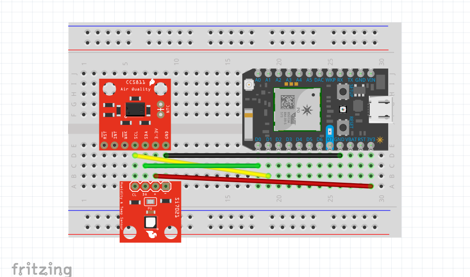
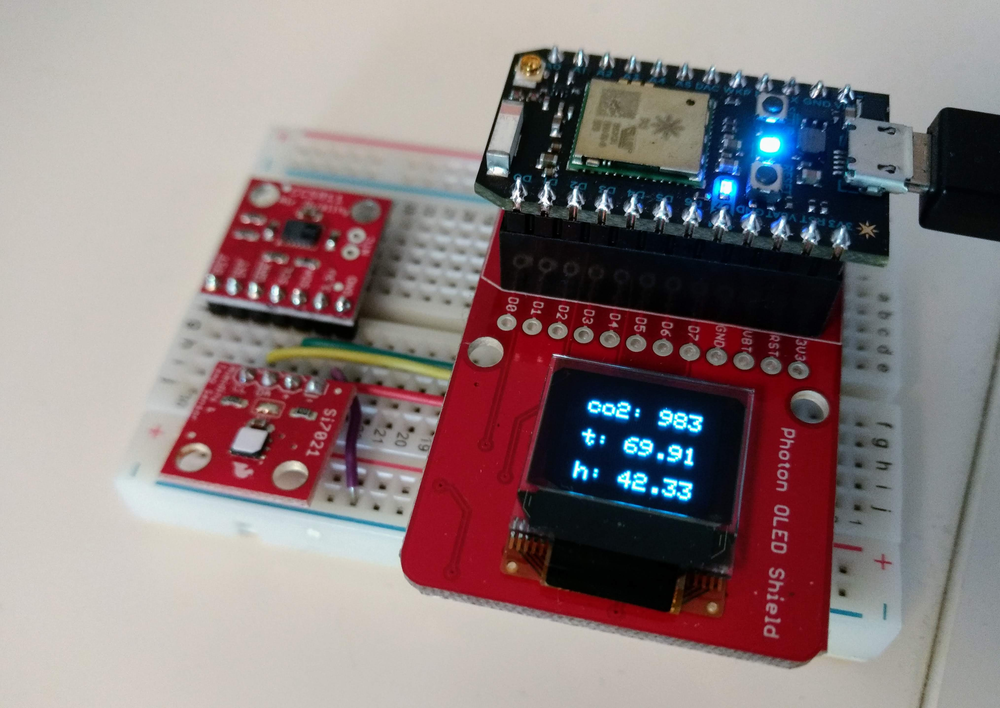

# SparkFun CCS811 Air Quality Sensor

The CCS811 is a sensor for monitoring indoor air quality. There are a number of configuration settings that make this sensor tricky to get up and running correctly. In this example we'll go over all of the steps I took to get readings from the CCS811 using a Particle Photon and a Si7021 temperature sensor.

### Required Parts

- [CCS811](https://www.sparkfun.com/products/14193) $19.95
- [Photon Core](https://store.particle.io/) $19.00
- [Breadboard](https://www.sparkfun.com/products/12002) $4.95
- [Photon Micro OLED Shield](https://www.sparkfun.com/products/13628) $19.95 *Optional*
- [Humidity and Temperature Sensor - Si7021](https://www.sparkfun.com/products/13763) $6.95
- [Break Away Headers](https://www.sparkfun.com/products/116) $1.50
- Misc wires for hookup $2

**Total Project Cost: ~$74.30 + tax & shipping costs**

Add a [Photon Battery Shield](https://www.sparkfun.com/products/13626) and [lithium battery](https://www.sparkfun.com/products/13851) to make your project portable!

## Wiring

For the complete schematic, open the [air-quality.fzz](https://github.com/blackcj/SparkFunCCS811/blob/master/images/air_quality.fzz) file in [Fritzing](http://fritzing.org/home/).

## Instructions

### Step 1: Run for 48 hrs

The CCS811 requires a one time 48 hour burn in period. After hooking up your components, run the `burn-in.ino` code for 48 hours. The temperature and humidity readings will be accurate during this time but the tVOC reading will likely jump around.

### Step 2: Switch the drive mode

From here on our we'll be using the `air-quality.ino` file. The `burn-in.ino` file is no longer needed.

By default, the CCS811 measures tVOC every second. This may be useful in some applications but is unnecessary for this example. If you end up putting this in an enclosure, reading every second will likely produce enough heat to throw of the temperature sensor.

When switching drive modes, the data sheet recommends setting the mode to **0 (idle)** for 10 minutes first. After 10 minutes have passed we can set the drive mode to **3 (every 60 seconds)**. The CCS811 needs ~30 minutes to calculate a baseline after setting the drive mode. Make sure the levels of tVOC and CO2 aren't elevated during this time.

> NOTE: The burn in only happens once but the baseline is established every time you reboot your Photon core. Make sure to ignore data collected during this time.

### Step 3: Record some data

The `air-quality.ino` is set up to display data on the micro OLED and publish the results to a variable `resultstr`. You can make a request to the device at a set interval to record the data.

> NOTE: Turning the WiFi off on your Photon core between data requests will help prevent the temperature from elevating.

## Resources

- [Spark Fun Hookup Guide](https://learn.sparkfun.com/tutorials/ccs811-air-quality-breakout-hookup-guide)
- [Temperature Sensors Comparison](http://www.kandrsmith.org/RJS/Misc/Hygrometers/calib_many.html)
- [Fritzing Spark Fun Parts](https://github.com/sparkfun/Fritzing_Parts)
